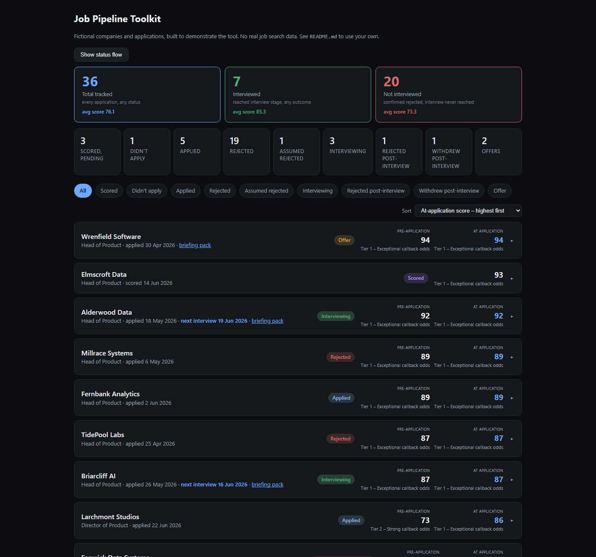
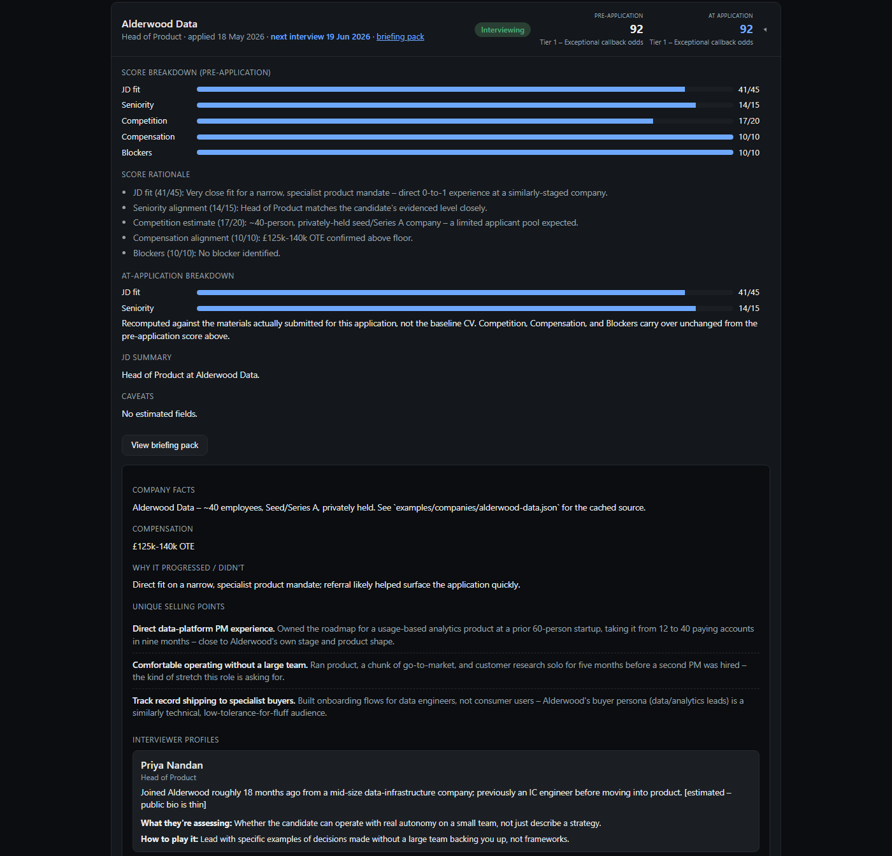
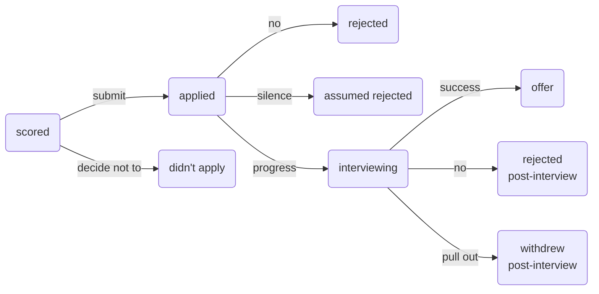

# Job Pipeline Toolkit

An open-source job-application tracker and JD-fit scorer, built as a Claude skill. It runs entirely inside your own [Claude.ai](https://claude.ai) Project or [Claude Cowork](https://claude.ai/discover/cowork) session — no separate app, no account with anyone but Anthropic, no data collected by anyone.

**[View the example dashboard →](https://ddkeyworth.github.io/ai-job-pipeline-toolkit/)**

  
  

The example above is entirely synthetic — fictional companies, fictional applications, generated to show what the tool produces. See "Getting started" to point it at your own data.

**The skill logic itself has actually been run, not just written.** See [`TESTING.md`](TESTING.md) for the results: a real live-search verification against a real public company, a full scoring run against a real (if short-lived — see the log) job posting, and the recalibration agent run for real against the example dataset, including an honest account of what it did and didn't prove.

## What this actually is

- `SKILL.md` — a Claude skill that scores job descriptions for callback likelihood, tracks applications, and generates a dashboard.
- A simple, documented file format for your applications (`schema/SCHEMA.md`) — one plain-text file per application, no database.
- A static HTML dashboard (`docs/index.html`) that reads that data and shows a three-level view: your pipeline → interview stage detail → a full "briefing pack" per interview. Default sort is prep-priority — active applications first, soonest known interview date on top, closed ones always last — with a switch to sort by score instead. Three headline numbers (Total tracked, Interviewed, Not interviewed) sit apart from the granular per-status breakdown, so the one number that actually answers "is this working" isn't buried in a row of nine tiles — "Not interviewed" rather than "Rejected" deliberately, since a post-interview rejection counts toward Interviewed, not this bucket. All three headline tiles show the average score within their group, so you can see at a glance whether the scoring rubric is actually tracking real callback outcomes.
- A small, exhaustive status vocabulary (see `schema/SCHEMA.md`) that distinguishes rejection after reaching interview stage from rejection before it, plus silence-inferred rejection and a deliberate decision not to apply — because reaching interview stage validates the scoring rubric's prediction regardless of what happens afterward, and a flat "rejected" throws that signal away.
- Briefing packs are standard-depth by default once an application reaches interview stage — company facts, comp, unique selling points, named-interviewer profiles, prep questions, questions to ask, watch-outs, and a freeform notes catch-all, all generated from your own CV/cover letters, not generic advice. Genuine gaps say `Currently unknown` plus a specific ask, rather than being invented or omitted — a living document filled in over conversation, not a one-shot output. One section — regional intelligence, a table of relationship/decision-making style by market — is deliberately the exception: genuinely optional, shown only when a role actually spans multiple markets, not forced onto every single-market application.

There is no backend, no server, and nothing to install beyond a text editor. The "AI" parts — scoring, live company research, dashboard generation — run as part of your normal Claude conversation, using your own Claude usage.

### The status flow

Every status is reached from exactly one place — no other transitions exist. The pre/post-interview split on the two rejection paths is deliberate: reaching `interviewing` validates the scoring rubric's prediction regardless of what happens next, so the dashboard and the recalibration agent both treat `rejected post-interview` as a different signal from a flat `rejected`, not the same outcome with extra detail.

## Getting started

### Option A — Claude.ai Project
1. Create a Claude.ai Project.
2. Upload `SKILL.md` as a custom skill (Settings → Capabilities → Skills → Add).
3. Upload your CV and start adding applications as Project files, following `schema/SCHEMA.md`.
4. Ask Claude to score a JD, log an application, or regenerate your dashboard.
5. When you want to see the dashboard, ask Claude to produce it as an Artifact.

### Option B — Claude Cowork (recommended if you have it)
1. Point Cowork at a local folder — your CV, and an `applications/` and `companies/` subfolder following `schema/SCHEMA.md`.
2. Install `SKILL.md`.
3. Ask Claude to score a JD, log an application, or regenerate the dashboard — it reads and writes the local folder directly, so there's no separate upload step.

Either way: **delete or ignore `examples/`** — it's a self-contained demo, not a template to build on top of. Your own data goes in your own folder or Project, never inside a clone of this repo (see Security below).

### Replacing the example data with your own
The `examples/` folder is only ever read by this repo's own build script (`scripts/build_dashboard.py`) to produce the public demo page. It has no other function. Your real tracked applications should live somewhere private — a Claude.ai Project's own files, or a local folder you choose — following the same schema, but never committed to a public fork of this repo.

## How scoring works

Five components, weighted per `config/weights.json` (edit that file to change emphasis — see its `_notes` field): JD fit, seniority alignment, competition estimate, comp alignment, and blockers (visa/right-to-work/etc). Full logic in `SKILL.md`.

Two agentic pieces, both bounded and on-demand — never a background process:
- **Live-search verification**: when scoring, the skill looks up real company facts (size, funding stage) rather than guessing from memory, and caches the result per company so you're not re-searching every time you apply to the same employer twice.
- **Recalibration** (ask for this explicitly — it never runs on its own): reviews your own logged outcomes and suggests weight adjustments, but only once you have enough data — see `config/weights.json → recalibration` for the exact thresholds, and why they're deliberately conservative.

## Security

- **This tool makes no contact with anyone, ever.** It researches and scores. It does not email, message, apply, or otherwise act on your behalf. Drafting a message is in scope; sending one is not.
- **No data leaves your own Claude session.** There is no server this project controls, no analytics, no telemetry.
- **Nothing in this repo is real.** Every company, role, and outcome in `examples/` is fictional, generated by `scripts/generate_examples.py` for demonstration only.
- **Your real data should never enter a public fork or clone of this repo.** Keep it in your own Claude.ai Project or your own local folder, outside version control, or in a private repo if you do want it tracked in git.

## Scope and non-goals

This is a personal utility, published in case it's useful to someone else — **not a maintained product.** No support is offered, no issues will necessarily be triaged, and no roadmap is promised. Fork it, change it, use pieces of it — that's the point of it being open source.

Explicitly out of scope, by design, not oversight:
- Real-time or background monitoring of job boards.
- Any integration with email, calendar, or other accounts.
- Any feature requiring credentials, API keys, or secrets to be stored in this repo.
- Contacting anyone or anything on the user's behalf.

## Publishing this repo (maintainer notes)

1. `python scripts/generate_examples.py` — regenerates `examples/` from scratch if it's ever changed.
2. `python scripts/build_dashboard.py` — rebuilds `docs/index.html` from whatever's currently in `examples/applications/`.
3. `python scripts/verify_recalibration.py` — sanity-checks the recalibration agent's gate and per-component signal against the current example data.
4. `python scripts/verify_consistency.py` — checks `SCHEMA.md`'s documented Briefing pack example actually parses, and that `docs/index.html`'s status list matches `scripts/_status.py`.
5. Enable GitHub Pages: Settings → Pages → Source → Deploy from branch → `main` → `/docs`. No Actions workflow needed.
6. Update the demo link at the top of this README once Pages is live.

**Troubleshooting a stuck Pages deployment:** if GitHub Actions shows a "pages build and deployment" run as successful but the live site still serves old content (check via `curl -I` on the Pages URL and compare the `Last-Modified` header to your latest commit time), that's a GitHub-side publish issue, not a problem with the repo — the build succeeded but the CDN artifact didn't actually update. Fix: Settings → Pages → change the source folder to something else, save, then change it back to `/docs` and save again. This forces a fresh deployment and has reliably cleared the stuck state.

## License

MIT — see `LICENSE`.
