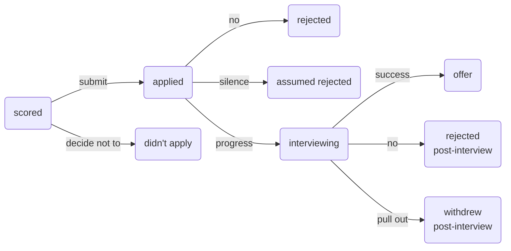

# Job Pipeline Toolkit

An open-source job-application tracker and JD-fit scorer, built as a Claude skill. It runs entirely inside your own [Claude.ai](https://claude.ai) Project or [Claude Cowork](https://claude.ai/discover/cowork) session – no separate app, no account with anyone but Anthropic, no data collected by anyone.

**[View the example dashboard →](https://ddkeyworth.github.io/ai-job-pipeline-toolkit/)**

  
  

The example above is entirely synthetic – fictional companies, fictional applications, generated to show what the tool produces. See "Getting started" to point it at your own data.

**The skill logic itself has actually been run, not just written.** See [`TESTING.md`](TESTING.md) for the results: a real live-search verification against a real public company, a full scoring run against a real (if short-lived – see the log) job posting, and the recalibration agent run for real against the example dataset, including an honest account of what it did and didn't prove. A repeatable five-case scoring eval also lives in [`eval/`](eval/README.md), with pre-registered expected score bands checked in CI on every change.

## What this actually is

- `SKILL.md` – a Claude skill that scores job descriptions for callback likelihood, tracks applications, and generates a dashboard.
- A simple, documented file format for your applications (`schema/SCHEMA.md`) – one plain-text file per application, no database.
- A static HTML dashboard (`docs/index.html`) that reads that data and shows a three-level view: your pipeline → interview stage detail → a full "briefing pack" per interview. Default sort is prep-priority – active applications first, soonest known interview date on top, closed ones always last – with a switch to sort by score instead. Three headline numbers (Total tracked, Interviewed, Not interviewed) sit apart from the granular per-status breakdown, so the one number that actually answers "is this working" isn't buried in a row of nine tiles – "Not interviewed" rather than "Rejected" deliberately, since a post-interview rejection counts toward Interviewed, not this bucket. All three headline tiles show the average score within their group, so you can see at a glance whether the scoring rubric is actually tracking real callback outcomes.
- A small, exhaustive status vocabulary (see `schema/SCHEMA.md`) that distinguishes rejection after reaching interview stage from rejection before it, plus silence-inferred rejection and a deliberate decision not to apply – because reaching interview stage validates the scoring rubric's prediction regardless of what happens afterward, and a flat "rejected" throws that signal away.
- Briefing packs are standard-depth by default once an application reaches interview stage – company facts, compensation, unique selling points, named-interviewer profiles, prep questions, questions to ask, watch-outs, and a freeform notes catch-all, all generated from your own CV/cover letters, not generic advice. Genuine gaps say `Currently unknown` plus a specific ask, rather than being invented or omitted – a living document filled in over conversation, not a one-shot output. One section – regional intelligence, a table of relationship/decision-making style by market – is deliberately the exception: genuinely optional, shown only when a role actually spans multiple markets, not forced onto every single-market application.
- Every scored application shows a one-line, real rationale per component directly on the dashboard – not just the numeric breakdown – so it's clear *why* a role scored the way it did, not just what.
- Before creating a new application file, the skill checks whether that company+role combination is already tracked, and flags a likely duplicate or repost rather than silently creating a second record.

There is no backend, no server, and nothing to install beyond a text editor. The "AI" parts – scoring, live company research, dashboard generation – run as part of your normal Claude conversation, using your own Claude usage.

### The status flow

Every status is reached from exactly one place – no other transitions exist. The pre/post-interview split on the two rejection paths is deliberate: reaching `interviewing` validates the scoring rubric's prediction regardless of what happens next, so the dashboard and the recalibration agent both treat `rejected post-interview` as a different signal from a flat `rejected`, not the same outcome with extra detail.

## Getting started

### Before you start: organising your own files

`SKILL.md` handles CV ambiguity reactively – if it finds more than one candidate CV file, it asks which one is current rather than guessing (see Step 1). A little upfront organisation avoids that question coming up at all, and makes your own files easier to navigate as your pipeline grows:

- **Keep exactly one current CV file, not a series of dated copies.** Overwrite or replace it as your experience changes rather than saving `CV-v2.pdf`, `CV-v3-final.pdf`, etc. alongside each other – the skill treats your CV as a single evolving baseline (see "Keeping your CV baseline current" below), and a folder with several similarly-named CVs is exactly the ambiguity Step 1 has to ask you to resolve.
- **If you do want to keep a history of past CV versions** (useful for seeing what a specific past application actually went out with), put them somewhere clearly separate from the current one – a dated archive folder, not mixed in alongside it.
- **Keep job descriptions you're scoring somewhere separate from your CV and cover letters**, so it's obvious at a glance which files are your own materials versus roles you're evaluating.
- **Keep recruiter/networking outreach separate from tracked applications.** Not every conversation with a recruiter or contact is a role worth scoring and logging – mixing the two makes it harder to tell "a real application in the pipeline" from "a conversation that hasn't turned into one yet."

None of this is enforced by the skill – it's a suggestion based on what tends to cause friction, not a required structure.

### Option A – Claude.ai Project
No git or terminal needed – this is entirely mouse-and-Explorer/Finder work.

1. Create a Claude.ai Project.
2. In Settings → Capabilities, make sure **Code execution and file creation** is turned on – skills won't work without it (Claude.ai says so directly on that toggle).
3. On this repo's GitHub page, click the green **Code** button → **Download ZIP**, then unzip it (Windows: right-click the downloaded file → **Extract All**. Mac: double-click it).
4. Rename the extracted folder to `job-pipeline`. Claude.ai's skill packaging requires the ZIP's single top-level folder to match the skill's name – the folder GitHub gives you (something like `ai-job-pipeline-toolkit-main`) won't match, so this step is required, not cosmetic.
5. Re-compress that renamed folder (Windows: right-click it → **Send to** → **Compressed (zipped) folder**. Mac: right-click it → **Compress**). You should now have `job-pipeline.zip` containing a single `job-pipeline` folder, with `SKILL.md`, `schema/`, `config/`, etc. directly inside it.
6. In your Project, go to Settings → Customize → Skills → Add → **Upload a skill**, and upload `job-pipeline.zip`. This brings in `SKILL.md` together with `schema/`, `config/`, and everything else it refers to by relative path – uploading `SKILL.md` on its own would leave those references unreachable.
7. Upload your CV and start adding applications as Project files, following `schema/SCHEMA.md`.
8. Ask Claude to score a JD, log an application, or regenerate your dashboard.
9. When you want to see the dashboard, ask Claude to produce it as an Artifact – it will render correctly, but read the limitation directly below before relying on it as your record.

**A real, ongoing cost of this option: Project files are read-only to Claude.** It can score, log, and update everything correctly within a conversation, but it can only hand you back a downloadable file – it cannot write to your Project's knowledge directly. Every single logged application and status update needs you to download the file and add/replace it in the Project yourself, or the change isn't actually saved anywhere and won't be there next time. Fine for occasional use; worth knowing about before committing to tracking dozens of applications this way – see Option B below if that matters to you.

**A second, separate cost of this option: the dashboard Artifact itself doesn't persist either.** Producing the dashboard as an Artifact in a plain Claude.ai Project chat gives you a real, correctly-working, interactive dashboard – but it only exists inside that one chat conversation. It will not appear in your Artifacts library at claude.ai/artifacts, and there's no way to find it again except scrolling back to that exact chat. Close it, lose track of it, or come back next week expecting to find it in your library, and it's gone – ask Claude to regenerate it and you'll get a new, equally-real, equally-temporary one. **A dashboard that actually persists and stays findable in your Artifacts library requires Claude Cowork – see Option B below. This is not a convenience upgrade for this specific capability, it's the only way to get it.**

### Option B – Claude Cowork (the only option that produces a dashboard that actually persists)
If you want a dashboard you can find again later in your Artifacts library (claude.ai/artifacts), without re-asking Claude to dig up an old chat and regenerate it, this isn't optional: Option A's dashboard Artifact is real but ephemeral (see above). Only a dashboard produced via Cowork is saved to your Artifacts library and stays there.

1. Point Cowork at a local folder – your CV, and an `applications/` and `companies/` subfolder following `schema/SCHEMA.md`.
2. Install `SKILL.md` the same way you'd install any Cowork skill, from the same local folder – Cowork already has direct access to the rest of the repo (`schema/`, `config/`) alongside it, so there's no separate bundling step like Option A's.
3. Ask Claude to score a JD, log an application, or regenerate the dashboard – it reads and writes the local folder directly, so there's no separate upload step, and no download/re-upload step for every subsequent update either. **Dashboards produced this way are saved to your Artifacts library and stay there** – this is the one capability Option A cannot replicate at all, not just less conveniently.

Either way: **delete or ignore `examples/`** – it's a self-contained demo, not a template to build on top of. Your own data goes in your own folder or Project, never inside a clone of this repo (see Security below).

### Making it yours
Nothing here is a fixed app – the dashboard, the scoring rubric, the schema are all just files your own Claude reads and regenerates. Once installed, ask Claude to change anything about it: add a column, track an extra field, change the dashboard's colours or layout, adjust how a component scores. It's your own instance, working directly with you – there's no separate build step or release to wait for.

### Replacing the example data with your own
The `examples/` folder is only ever read by this repo's own build script (`scripts/build_dashboard.py`) to produce the public demo page. It has no other function. Your real tracked applications should live somewhere private – a Claude.ai Project's own files, or a local folder you choose – following the same schema, but never committed to a public fork of this repo.

### Updating the skill later
If you pull a newer version of this repo and want to update your Claude.ai skill, go to Settings → Customize → Skills → job-pipeline → the **⋮** menu → **Replace**, and select the new zip (same rename-and-rezip steps as Option A above). One thing worth knowing: replacing a skill's content doesn't affect any chat that was already open before the replace – it keeps using whatever version was loaded when that chat started. Start a **new chat** to pick up the update.

### Keeping your CV baseline current
Your CV drives every score, so keep it current as your experience changes. There's no separate process – just give Claude an updated version when you have one (re-upload the file in a Claude.ai Project, or edit/replace the file in your local folder for Cowork) and say so. Claude confirms which file it's now using and applies it to all scoring from that point on. Past scores are never silently rewritten – see `score.locked` in `schema/SCHEMA.md`.

Role-tailored CVs and cover letters are a separate, later concern – see `application_materials` in `schema/SCHEMA.md`. A JD always gets scored against your baseline, since a tailored version doesn't exist yet for a role you haven't applied to. The question of what you actually submitted only comes up once you tell Claude you've applied.

Your compensation floor works the same way – set once (see "How scoring works" below), stored in `preferences.md`, and updated the same way as your CV: tell Claude it's changed and it confirms and applies the new figure going forward, without silently rescoring past applications.

## How scoring works

Five components, weighted per `config/weights.json` (edit that file to change emphasis – see its `_notes` field): JD fit, seniority alignment, competition estimate, compensation alignment, and blockers (visa/right-to-work/etc). Full logic in `SKILL.md`.

**Compensation alignment** is asked for explicitly, never inferred from your CV – most CVs don't state a figure at all. Give Claude your on-target-earnings floor (base salary plus target bonus/variable comp; equity is deliberately excluded from the number and noted separately instead) and it's saved to `preferences.md`, the same way your CV baseline is. Scoring is a sliding scale against that floor, not a pass/fail cutoff – a role modestly below floor scores meaningfully better than one far below it. When a JD doesn't state a figure, the skill attempts a live-search-informed estimate first, the same way it does for competition, rather than defaulting straight to a placeholder score.

Two agentic pieces, both bounded and on-demand – never a background process:
- **Live-search verification**: when scoring, the skill looks up real company facts (size, funding stage) rather than guessing from memory, and caches the result per company so you're not re-searching every time you apply to the same employer twice. A fact is only marked `confirmed` once two independent sources agree – a single source, however authoritative it looks, is marked `estimated` instead.
- **Recalibration** (ask for this explicitly – it never runs on its own): reviews your own logged outcomes and suggests weight adjustments, but only once you have enough data – see `config/weights.json → recalibration` for the exact thresholds, and why they're deliberately conservative.

## Security

- **This tool makes no contact with anyone, ever.** It researches and scores. It does not email, message, apply, or otherwise act on your behalf. Drafting a message is in scope; sending one is not.
- **No data leaves your own Claude session.** There is no server this project controls, no analytics, no telemetry.
- **Nothing in this repo is real.** Every company, role, and outcome in `examples/` is fictional, generated by `scripts/generate_examples.py` for demonstration only.
- **Your real data should never enter a public fork or clone of this repo.** Keep it in your own Claude.ai Project or your own local folder, outside version control, or in a private repo if you do want it tracked in git.

## Scope and non-goals

This is a personal utility, published in case it's useful to someone else – **not a maintained product.** No support is offered, no issues will necessarily be triaged, and no roadmap is promised. Fork it, change it, use pieces of it – that's the point of it being open source.

Explicitly out of scope, by design, not oversight:
- Real-time or background monitoring of job boards.
- Any integration with email, calendar, or other accounts.
- Any feature requiring credentials, API keys, or secrets to be stored in this repo.
- Contacting anyone or anything on the user's behalf.

## Publishing this repo (maintainer notes)

1. `python scripts/generate_examples.py` – regenerates `examples/` from scratch if it's ever changed.
2. `python scripts/build_dashboard.py` – rebuilds `docs/index.html` from whatever's currently in `examples/applications/`.
3. `python scripts/verify_recalibration.py` – sanity-checks the recalibration agent's gate, per-component signal, and joint-model coefficients against the current example data.
4. `python scripts/verify_consistency.py` – checks `SCHEMA.md`'s documented Briefing pack example actually parses, and that `docs/index.html`'s status list matches `scripts/_status.py`.
5. `python scripts/verify_eval_results.py` – checks the latest scoring-eval run (`eval/results/`) against its pre-registered expected bands (`eval/expected_bands.json`).
6. Enable GitHub Pages: Settings → Pages → Source → Deploy from branch → `main` → `/docs`. No Actions workflow needed.
7. Update the demo link at the top of this README once Pages is live.

**Troubleshooting a stuck Pages deployment:** if GitHub Actions shows a "pages build and deployment" run as successful but the live site still serves old content (check via `curl -I` on the Pages URL and compare the `Last-Modified` header to your latest commit time), that's a GitHub-side publish issue, not a problem with the repo – the build succeeded but the CDN artifact didn't actually update. Fix: Settings → Pages → change the source folder to something else, save, then change it back to `/docs` and save again. This forces a fresh deployment and has reliably cleared the stuck state.

## License

MIT – see `LICENSE`.
